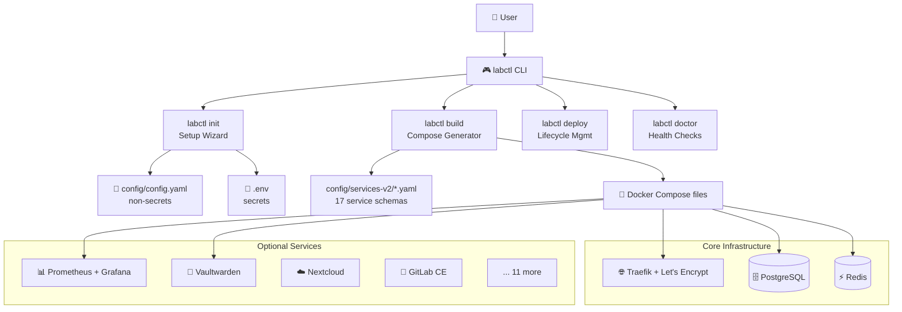

# 🏠 Enterprise Home Lab CLI

[](https://www.python.org/downloads/)
[](https://docs.docker.com/get-docker/)
[](LICENSE)

A comprehensive, enterprise-grade home lab infrastructure management system with **interactive service selection**, automated Docker Compose generation, and full lifecycle management.

## 🚀 Quick Start

```bash
git clone https://github.com/patel5d2/enterprise-homelab-boilerplate
cd enterprise-homelab-boilerplate
./bootstrap.sh
```

That's it. Bootstrap handles everything: prerequisites, Python venv, package install, `.env` generation, and a final health check. See the [Starter Guide](StarterGuide.md) for a step-by-step walkthrough with expected output.

## 🏗️ Architecture



## 📦 Available Services (17)

| Category | Services |
|---|---|
| **Core Infrastructure** | Traefik, PostgreSQL, Redis, MongoDB |
| **Monitoring** | Prometheus, Grafana, Monitoring Stack, Uptime Kuma |
| **Security & Secrets** | Vaultwarden |
| **Storage & Collaboration** | Nextcloud, BookStack |
| **Networking & DNS** | Pi-hole, Nginx Proxy Manager |
| **Dev & CI/CD** | GitLab, Jenkins, n8n |
| **Dashboards** | Glance |

## 🎮 CLI Reference

```
labctl init       — Interactive service setup wizard
labctl init -s postgresql  — Reconfigure one service only
labctl doctor     — Post-install health check
labctl build      — Generate Docker Compose files
labctl deploy     — Start services
labctl status     — Show running services
labctl validate   — Validate config.yaml
labctl logs       — Tail service logs
labctl stop       — Stop all services
```

## 📚 Documentation

- **[Starter Guide](StarterGuide.md)** — Fresh machine walkthrough with expected output
- **[Architecture](docs/architecture.md)** — How the modules fit together
- **[Customizing](docs/customizing.md)** — Adding services, overriding defaults
- **[Service Docs](docs/services/)** — Per-service configuration reference

## 🔒 Security Notes

- Secrets are generated automatically and stored only in `.env` (never in `config.yaml`)
- `.env` is in `.gitignore` — never commit it
- Traefik uses Let's Encrypt automatically via Cloudflare DNS challenge
- All service passwords are cryptographically random (≥24 chars)

## 🤝 Contributing

1. Fork → branch → PR
2. `make test` must pass
3. New services: add a schema to `config/services-v2/` following [SCHEMA.md](config/services-v2/SCHEMA.md)
